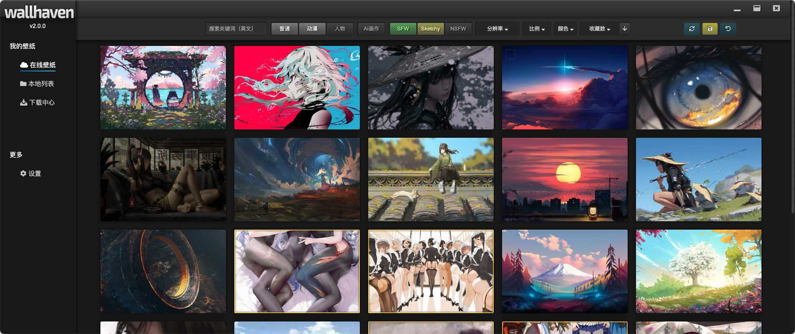
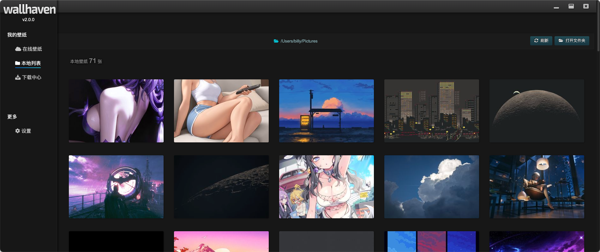
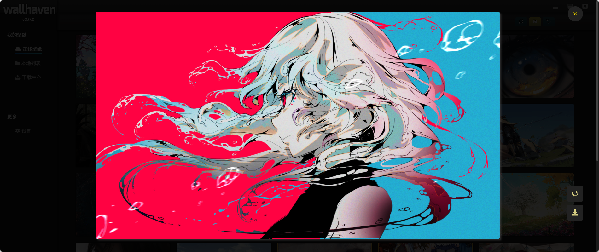
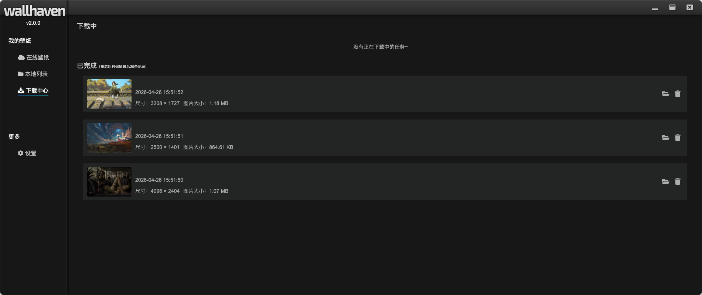
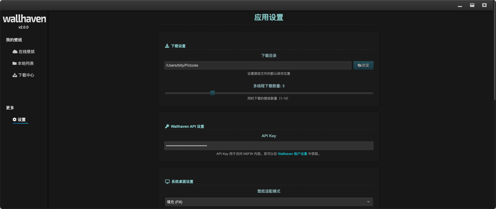

# Wallhaven - 在线壁纸浏览器

> 基于 Electron + Vue 3 + Vite + TypeScript 构建的跨平台桌面壁纸应用

> 该项目参考了 [leoFitz1024](https://github.com/leoFitz1024) 的 [Wallhaven](https://github.com/leoFitz1024/wallhaven) 项目，并进行了大量优化和扩展。 RESPECT

> 本项目使用 AI 辅助开发工具实现。

## ✨ 版本亮点 (v2.1.0)

本项目已完成**全面架构重构**，在保持用户体验不变的前提下，实现了代码架构的大幅升级：

- 🏗️ **分层架构**: Client → Repository → Service → Composable → View 清晰分层
- 🔌 **IPC 模块化**: 866 行单文件拆分为 8 个独立 handler，职责清晰
- 🛡️ **类型安全**: 消除 60+ 处 `any` 类型，100% TypeScript 覆盖
- ⚠️ **错误处理**: 全局错误处理器 + 组件级 ErrorBoundary 双重保障
- 📦 **代码复用**: useAlert 等 composables 消除 76 行重复代码
- 🧹 **代码清理**: 移除 5 个测试/演示文件，路由懒加载优化

## 🎯 项目简介

Wallhaven 是一个功能丰富的跨平台桌面壁纸浏览和管理应用，提供：

- 🔍 强大的搜索功能（关键词、分类、纯度、分辨率等）
- 🖼️ 流畅的图片预览和下载
- 💾 批量下载管理（支持暂停/恢复）
- 💻 桌面壁纸设置（6 种适配模式）
- 📁 本地壁纸管理
- 🌐 跨平台支持（macOS、Windows、Linux）
- ⚡ 无限滚动加载，浏览体验流畅

## 🛠️ 技术栈

- **桌面框架**: Electron 41+
- **前端框架**: Vue 3.5+ (Composition API)
- **构建工具**: electron-vite 5+ / Vite 8+
- **语言**: TypeScript 6+
- **状态管理**: Pinia 3+
- **路由**: Vue Router 5+
- **HTTP 客户端**: Axios 1.15+
- **打包工具**: electron-builder 26+

## 📁 项目结构

```
wallhaven/
├── electron/                 # Electron 主进程代码
│   ├── main/                # 主进程
│   │   ├── index.ts         # 主进程入口
│   │   └── ipc/             # IPC 通信处理（模块化）
│   │       ├── base.ts          # 基础类型和工具函数
│   │       ├── file.handler.ts  # 文件操作
│   │       ├── download.handler.ts # 下载管理
│   │       ├── settings.handler.ts # 设置存储
│   │       ├── wallpaper.handler.ts # 壁纸设置
│   │       ├── window.handler.ts # 窗口控制
│   │       ├── cache.handler.ts # 缓存管理
│   │       └── api.handler.ts   # API 代理
│   └── preload/             # 预加载脚本
│       └── index.ts         # 预加载脚本入口
├── src/                     # Vue 渲染进程代码
│   ├── components/          # Vue 组件
│   ├── composables/         # 组合式函数
│   │   ├── useAlert.ts          # Alert 状态管理
│   │   ├── useWallpaperList.ts  # 壁纸列表逻辑
│   │   ├── useDownload.ts       # 下载逻辑
│   │   └── useSettings.ts       # 设置逻辑
│   ├── services/            # 业务服务层
│   │   ├── WallpaperService.ts
│   │   ├── DownloadService.ts
│   │   └── SettingsService.ts
│   ├── repositories/        # 数据访问层
│   │   ├── WallpaperRepository.ts
│   │   ├── DownloadRepository.ts
│   │   └── SettingsRepository.ts
│   ├── clients/             # 底层客户端
│   │   ├── ElectronClient.ts    # Electron API 封装
│   │   └── ApiClient.ts         # HTTP 请求封装
│   ├── stores/              # Pinia 状态管理
│   ├── types/               # TypeScript 类型定义
│   ├── errors/              # 自定义错误类
│   └── utils/               # 工具函数
├── build/                   # 构建资源
├── resources/               # 应用资源（图标等）
├── electron.vite.config.ts  # electron-vite 配置
└── electron-builder.yml     # electron-builder 配置
```

## 🏗️ 架构概览

```
┌─────────────────────────────────────────────────────────────────────┐
│                           View Layer                                 │
│                    (Vue Components)                                  │
├─────────────────────────────────────────────────────────────────────┤
│                       Composable Layer                               │
│            (useWallpaperList, useDownload, useSettings)              │
├─────────────────────────────────────────────────────────────────────┤
│                        Service Layer                                 │
│            (WallpaperService, DownloadService, SettingsService)      │
├─────────────────────────────────────────────────────────────────────┤
│                      Repository Layer                                │
│          (WallpaperRepository, DownloadRepository, SettingsRepo)     │
├─────────────────────────────────────────────────────────────────────┤
│                        Client Layer                                  │
│                  (ElectronClient, ApiClient)                         │
├─────────────────────────────────────────────────────────────────────┤
│                     Infrastructure                                   │
│              (Electron API, HTTP, LocalStorage)                      │
└─────────────────────────────────────────────────────────────────────┘
```

## 🚀 快速开始

### 环境要求

- Node.js: ^20.19.0 || >=22.12.0
- npm 或 yarn 或 pnpm

### 安装依赖

```sh
npm install
```

### 开发模式（桌面应用）

```sh
npm run dev
```

这将启动 Electron 桌面应用，支持热重载（HMR）。

### 开发模式（仅浏览器）

如果只想在浏览器中调试渲染进程：

```sh
npm run preview
```

### 生产构建

**构建所有平台：**

```sh
npm run build
```

**构建特定平台：**

Windows:

```sh
npm run build:win
```

macOS:

```sh
npm run build:mac
```

Linux:

```sh
npm run build:linux
```

构建产物将输出到 `release/` 目录。

### 预览生产构建

```sh
npm run preview
```

### 类型检查

```sh
npm run type-check
```

### 代码格式化

```sh
npm run format
```

## 💡 核心功能

### 1. 壁纸搜索



支持多种筛选条件：

- 关键词搜索
- 分类筛选（普通、动漫、人物）
- 纯度筛选（SFW、Sketchy、NSFW）
- 分辨率选择
- 比例筛选
- 颜色筛选
- 排序方式（相关性、随机、日期、浏览量等）
  
### 2. 本地列表



### 2. 图片预览


- 大图预览
- 全屏查看
- 流畅的动画效果
- 快捷键支持

### 3. 无限滚动

- 自动加载更多
- 节流优化
- 提前预加载

### 4. 下载管理



- 批量下载
- 多线程支持（1-10）
- 暂停/恢复功能
- 进度追踪

### 5. 应用设置



提供丰富的个性化配置选项：

- **下载设置**
  - 自定义下载目录
  - 多线程下载数量调节（1-10）

- **API 设置**
  - Wallhaven API Key 配置
  - 支持 NSFW 内容访问

- **桌面设置**
  - 6 种壁纸适配模式（填充、适应、拉伸、平铺、居中、跨屏）
  - 实时预览效果
  - 所有设置自动保存到本地


## 🤝 贡献指南

欢迎提交 Issue 和 Pull Request！

1. Fork 本仓库
2. 创建特性分支 (`git checkout -b feature/AmazingFeature`)
3. 提交更改 (`git commit -m 'Add some AmazingFeature'`)
4. 推送到分支 (`git push origin feature/AmazingFeature`)
5. 开启 Pull Request

## 📄 许可证

本项目采用 MIT 许可证 - 详见 [LICENSE](LICENSE) 文件

## 🙏 致谢

- [Wallhaven](https://github.com/leoFitz1024/wallhaven)
- [Vue.js](https://vuejs.org/)
- [Vite](https://vitejs.dev/)
- [Pinia](https://pinia.vuejs.org/)
- [Wallhaven API](https://wallhaven.cc/help/api)

---
