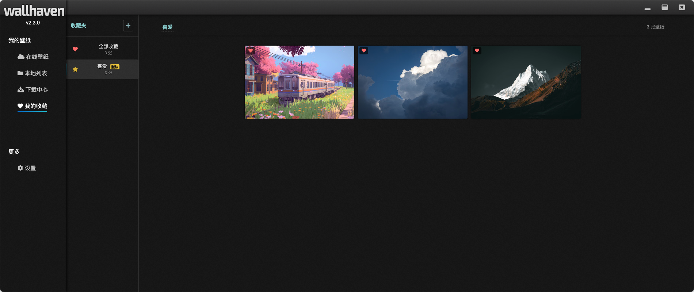

# Wallhaven 壁纸浏览器

<p align="center">
  <strong>一款优雅的跨平台桌面壁纸浏览与下载应用</strong>
</p>

<p align="center">
  基于 Electron + Vue 3 + TypeScript 构建
</p>

<p align="center">
  <a href="#-版本亮点">版本亮点</a> •
  <a href="#-功能特性">功能特性</a> •
  <a href="#-技术栈">技术栈</a> •
  <a href="#-快速开始">快速开始</a> •
  <a href="#-项目结构">项目结构</a>
</p>

---

> 该项目参考了 [leoFitz1024](https://github.com/leoFitz1024) 的 [Wallhaven](https://github.com/leoFitz1024/wallhaven) 项目，并进行了大量优化和扩展。RESPECT

> 本项目使用 AI 辅助开发工具实现。

## ✨ 版本亮点 (v2.3.0)

本项目已完成**全面架构重构**，在保持用户体验不变的前提下，实现了代码架构的大幅升级：

- 🏗️ **分层架构**: Client → Repository → Service → Composable → View 清晰分层
- 🔌 **IPC 模块化**: 866 行单文件拆分为 8 个独立 handler，职责清晰
- 🛡️ **类型安全**: 消除 60+ 处 `any` 类型，100% TypeScript 覆盖
- ⚠️ **错误处理**: 全局错误处理器 + 组件级 ErrorBoundary 双重保障
- 📦 **代码复用**: useAlert 等 composables 消除 76 行重复代码
- 🧹 **代码清理**: 移除 5 个测试/演示文件，路由懒加载优化
- ⭐ **收藏功能**: 完整的收藏夹管理系统，O(1) 高效查询
- ⬇️ **断点续传**: 下载支持暂停/恢复，重启后自动恢复任务

---

## 🎯 项目简介

Wallhaven 是一个功能丰富的跨平台桌面壁纸浏览和管理应用，提供：

- 🔍 强大的搜索功能（关键词、分类、纯度、分辨率等）
- 🖼️ 流畅的图片预览和下载
- 💾 批量下载管理（支持暂停/恢复、断点续传）
- ⭐ 收藏夹管理（创建、重命名、删除、多收藏夹支持）
- 💻 桌面壁纸设置（6 种适配模式）
- 📁 本地壁纸管理
- 🌐 跨平台支持（macOS、Windows、Linux）
- ⚡ 无限滚动加载，浏览体验流畅

---

## 🚀 核心功能

### 1. 在线壁纸搜索


支持多种筛选条件：

- 关键词搜索
- 分类筛选（普通、动漫、人物）
- 纯度筛选（SFW、Sketchy、NSFW）
- 分辨率选择
- 比例筛选
- 颜色筛选
- 排序方式（相关性、随机、日期、浏览量等）

### 2. 本地壁纸管理


- 浏览已下载的壁纸
- 设置为桌面壁纸
- 删除本地文件

### 3. 图片预览


- 大图预览
- 全屏查看
- 流畅的动画效果
- 键盘快捷键支持（上一张/下一张）

### 4. 下载管理


- 批量下载
- 多线程支持（1-10）
- 暂停/恢复功能
- 进度追踪
- **断点续传**：网络中断后自动恢复
- **持久化**：重启应用后自动恢复未完成任务

### 5. 收藏夹



- 创建自定义收藏夹
- 重命名、删除收藏夹
- **快捷收藏**：左键快速收藏到默认收藏夹
- **收藏选择器**：右键选择目标收藏夹
- **多收藏夹支持**：单个壁纸可属于多个收藏夹
- **O(1) 高效查询**：大数据量下依然流畅

### 6. 应用设置


提供丰富的个性化配置选项：

- **下载设置**
  - 自定义下载目录
  - 多线程下载数量调节（1-10）

- **API 设置**
  - Wallhaven API Key 配置
  - 支持 NSFW 内容访问

- **桌面设置**
  - 6 种壁纸适配模式（填充、适应、拉伸、平铺、居中、跨屏）
  - 实时预览效果

- **缓存管理**
  - 查看缓存占用
  - 一键清理缩略图和临时文件

---

## 🛠️ 技术栈

| 类别 | 技术 | 版本 |
|------|------|------|
| 桌面框架 | Electron | v41.2.2 |
| 前端框架 | Vue 3 (Composition API) | v3.5.32 |
| 构建工具 | electron-vite / Vite | v5.0.0 / v7.3.2 |
| 语言 | TypeScript | v6.0.0 |
| 状态管理 | Pinia | v3.0.4 |
| 路由 | Vue Router | v5.0.4 |
| HTTP 客户端 | Axios | v1.15.0 |
| 图片处理 | Sharp | v0.34.5 |
| 打包工具 | electron-builder | v26.8.1 |

---

## 🚀 快速开始

### 环境要求

- Node.js `^20.19.0` 或 `>=22.12.0`
- npm 或 yarn 或 pnpm

### 安装依赖

```bash
npm install
```

### 开发模式

```bash
# 启动 Electron 桌面应用（支持热重载）
npm run dev

# 仅在浏览器中预览
npm run preview
```

### 构建应用

```bash
# Windows
npm run build:win

# macOS
npm run build:mac

# Linux
npm run build:linux
```

构建产物将输出到 `release/` 目录。

### 其他命令

```bash
# 类型检查
npm run type-check

# 代码检查
npm run lint

# 代码格式化
npm run format

# 单元测试
npm run test:unit
```

---

## 📁 项目结构

```
wallhaven/
├── electron/                 # Electron 主进程代码
│   ├── main/                 # 主进程
│   │   ├── index.ts          # 应用入口、窗口管理
│   │   └── ipc/              # IPC 处理器模块（8 个独立 handler）
│   │       ├── base.ts           # 基础类型和工具函数
│   │       ├── file.handler.ts   # 文件操作
│   │       ├── download.handler.ts # 下载管理
│   │       ├── settings.handler.ts # 设置存储
│   │       ├── wallpaper.handler.ts # 壁纸设置
│   │       ├── window.handler.ts  # 窗口控制
│   │       ├── cache.handler.ts   # 缓存管理
│   │       └── api.handler.ts     # API 代理
│   └── preload/              # 预加载脚本
│       └── index.ts          # 暴露安全 API 给渲染进程
│
├── src/                      # Vue 渲染进程代码
│   ├── clients/              # 客户端层 (Electron API 封装)
│   │   ├── ElectronClient.ts     # Electron API 封装
│   │   └── ApiClient.ts          # HTTP 请求封装
│   ├── composables/          # 组合式函数层
│   │   ├── core/                 # 核心功能 (useAlert 等)
│   │   ├── download/             # 下载相关
│   │   ├── favorites/            # 收藏相关
│   │   ├── local/                # 本地壁纸相关
│   │   ├── settings/             # 设置相关
│   │   └── wallpaper/            # 壁纸相关
│   ├── components/           # Vue 组件
│   ├── errors/               # 自定义错误类
│   ├── repositories/         # 数据仓库层
│   ├── router/               # 路由配置
│   ├── services/             # 服务层
│   ├── stores/               # Pinia 状态管理
│   ├── types/                # TypeScript 类型定义
│   ├── utils/                # 工具函数
│   └── views/                # 页面组件
│       ├── OnlineWallpaper.vue    # 在线壁纸页
│       ├── LocalWallpaper.vue     # 本地壁纸页
│       ├── DownloadWallpaper.vue  # 下载中心页
│       ├── FavoritesPage.vue      # 收藏页
│       └── SettingPage.vue        # 设置页
│
├── resources/                # 应用资源（图标等）
├── scripts/                  # 构建脚本
└── .planning/                # 项目规划文档
```

---

## 🏗️ 架构设计

### 分层架构

项目采用清晰的分层架构，确保代码的可维护性和可测试性：

```
┌─────────────────────────────────────────────────────────┐
│                     View Layer                          │
│  (OnlineWallpaper, LocalWallpaper, DownloadWallpaper,  │
│   FavoritesPage, SettingPage)                          │
└─────────────────────────────────────────────────────────┘
                          │
                          ▼
┌─────────────────────────────────────────────────────────┐
│                  Composable Layer                       │
│  (useAlert, useWallpaperList, useDownload, useSettings,│
│   useFavorites, useCollections)                         │
└─────────────────────────────────────────────────────────┘
                          │
                          ▼
┌─────────────────────────────────────────────────────────┐
│                   Service Layer                         │
│  (WallpaperService, DownloadService, SettingsService,  │
│   FavoritesService, CollectionsService)                 │
└─────────────────────────────────────────────────────────┘
                          │
                          ▼
┌─────────────────────────────────────────────────────────┐
│                 Repository Layer                        │
│  (WallpaperRepository, DownloadRepository,             │
│   SettingsRepository, FavoritesRepository)              │
└─────────────────────────────────────────────────────────┘
                          │
                          ▼
┌─────────────────────────────────────────────────────────┐
│                    Client Layer                         │
│  (ElectronClient, ApiClient)                           │
└─────────────────────────────────────────────────────────┘
```

### 分层约束

- **Views** 不直接访问 Store，必须通过 Composables
- **Views** 不直接调用 electronAPI，必须通过 Services
- **Composables** 封装业务逻辑，协调 Service 和 Store

### 进程模型

- **主进程**：应用生命周期管理、原生 API 调用、文件系统操作
- **渲染进程**：Vue 应用，负责 UI 渲染和用户交互
- **预加载脚本**：安全桥接主进程和渲染进程的通信

---

## 📝 版本历史

| 版本 | 发布日期 | 主要功能 |
|------|----------|----------|
| v2.6 | 2026-04-29 | 设置页缓存优化 |
| v2.5 | 2026-04-29 | 壁纸收藏功能 |
| v2.4 | 2026-04-27 | ImagePreview 导航功能 |
| v2.3 | 2026-04-27 | ElectronAPI 分层重构 |
| v2.2 | 2026-04-27 | Store 分层迁移 |
| v2.1 | 2026-04-27 | 下载断点续传 |
| v2.0 | 2026-04-26 | 架构重构 |

---

## 🤝 贡献指南

欢迎提交 Issue 和 Pull Request！

1. Fork 本仓库
2. 创建特性分支 (`git checkout -b feature/AmazingFeature`)
3. 提交更改 (`git commit -m 'Add some AmazingFeature'`)
4. 推送到分支 (`git push origin feature/AmazingFeature`)
5. 开启 Pull Request

---

## 📄 许可证

本项目采用 MIT 许可证 - 详见 [LICENSE](LICENSE) 文件

---

## 🙏 致谢

- [leoFitz1024/wallhaven](https://github.com/leoFitz1024/wallhaven) - 项目灵感来源
- [Wallhaven](https://wallhaven.cc/) - 提供优质的壁纸 API
- [Vue.js](https://vuejs.org/) - 渐进式 JavaScript 框架
- [Electron](https://www.electronjs.org/) - 跨平台桌面应用框架
- [Vite](https://vitejs.dev/) - 下一代前端构建工具
- [Pinia](https://pinia.vuejs.org/) - Vue 状态管理

---

<p align="center">
  Made with ❤️ by BillyJR
</p>
